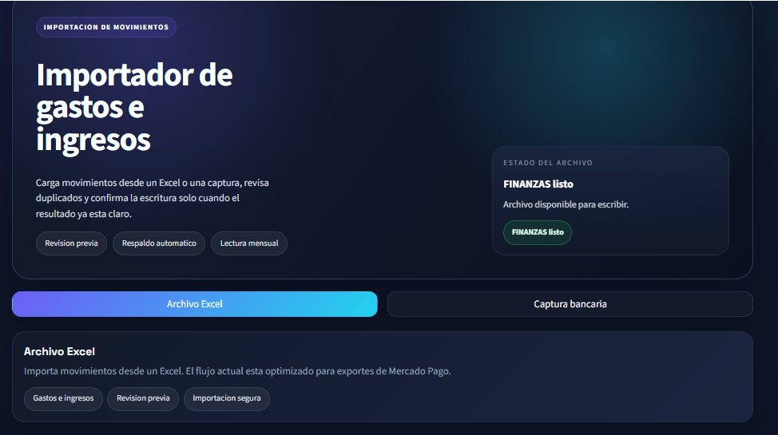
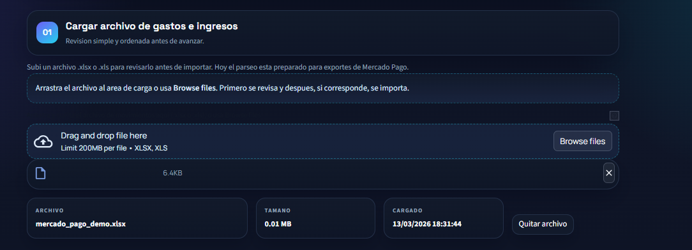
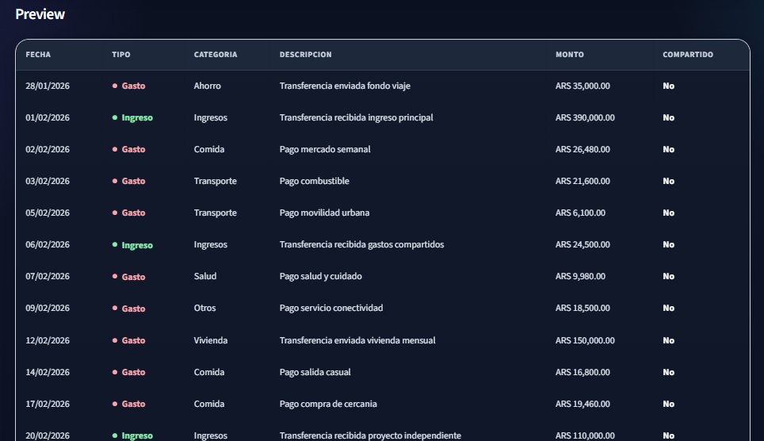
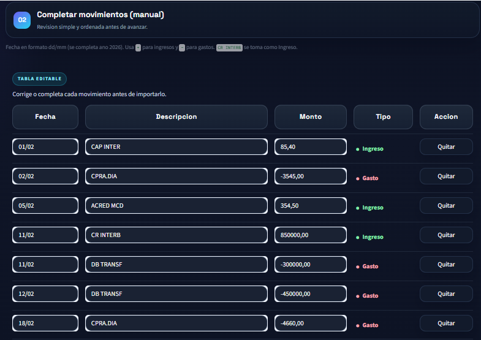
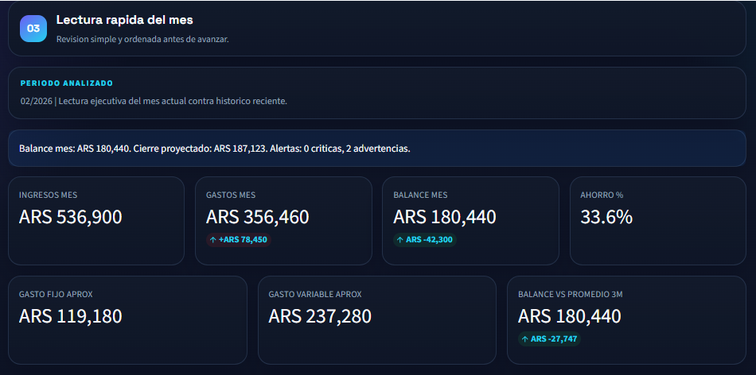
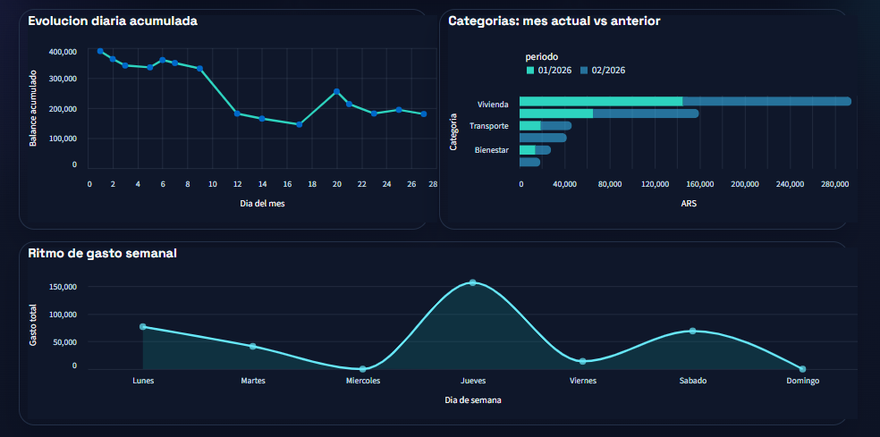
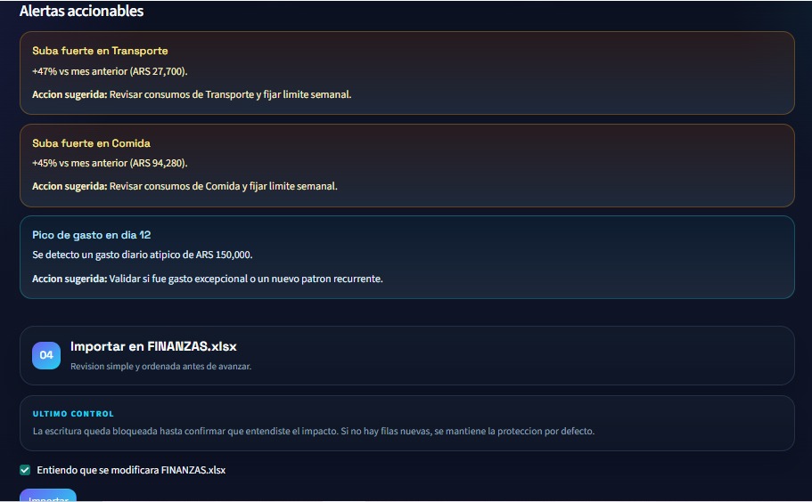

# Financial Operations Importer

Streamlit tool for transaction intake, review, deduplication, and controlled workbook updates.

A local Streamlit application that imports, reviews, and consolidates financial transactions into a structured workbook from two sources:
- Mercado Pago Excel exports
- bank screenshots with assisted manual entry and optional OCR preload

The goal is to reduce manual work, prevent duplicate imports, and keep a clear audit trail before updating the destination workbook.

## What It Solves

- normalizes transactions into a shared schema
- detects duplicates by unique reference and compound key
- creates a backup before modifying the workbook
- shows a preview, control metrics, and monthly insights
- supports safe demo assets so the full workflow can be shared without exposing real data

## Business Value

- reduces manual transaction entry
- prevents duplicate imports before write-back
- preserves workbook structure and formulas
- improves monthly traceability with preview, alerts, and KPIs
- adds a control layer before updating the final file

## Current Scope

- `Mercado Pago (Excel)`: imports `.xlsx` or `.xls` files exported from Mercado Pago
- `Bank capture`: accepts `.jpg`, `.jpeg`, or `.png` files and lets the user complete movements in an editable table
- `Destination workbook`: writes to sheet `Control de ingresos y gastos`, table `tblControlIngresosGastos`

## Requirements

- Python 3.10+
- dependencies installed from `requirements.txt`
- for `Bank capture`: Tesseract OCR installed locally if OCR preload is needed

## Installation

```bash
pip install -r requirements.txt
```

## Run

```bash
streamlit run app.py
```

## Workflow

1. Set the local path to the destination workbook.
2. Choose the import mode.
3. Upload an Excel file or bank captures.
4. Review the preview, duplicates, and control metrics.
5. Confirm the import.

## Privacy and Demo Assets

The repository includes safe demo assets:
- `mercado_pago_demo.xlsx`
- `FINANZAS_demo.xlsx`

These files are synthetic and exist to demonstrate the full workflow without exposing real personal data.

Real or original bank screenshots can still be used for local testing, but they are not part of the public portfolio material in this repository.

If `FINANZAS_demo.xlsx` exists in the project folder, the app selects it by default to reduce the risk of writing into a real workbook.

## Optional Local Rules

To keep the repository public-safe, sensitive transfer rules are not hardcoded in the codebase. If needed for local usage, they can be configured through environment variables:

- `FINANCE_IMPORTER_SELF_TRANSFER_GROUPS`
- `FINANCE_IMPORTER_SHARED_TRANSFER_GROUPS`

Format:

- separate rule groups with `;`
- separate tokens inside each group with `,`

Example:

```powershell
$env:FINANCE_IMPORTER_SELF_TRANSFER_GROUPS="cuenta,propia;ahorro,interno"
$env:FINANCE_IMPORTER_SHARED_TRANSFER_GROUPS="gastos,compartidos;contacto,demo"
```

## Regenerate Demo Assets

```bash
.\.venv\Scripts\python.exe scripts\generate_demo_assets.py
```

This recreates:
- a Mercado Pago demo export with January and February 2026 transactions
- a `FINANZAS_demo.xlsx` workbook with prior history to test import, dedupe, and insights

For the banking flow in the README or portfolio, use app screenshots generated from demo material or sufficiently anonymized inputs.

## Suggested Screenshots

Public-ready screenshots live in `docs/screenshots/`:
- [`01-home.png`](docs/screenshots/01-home.png)
- [`02-excel-upload.png`](docs/screenshots/02-excel-upload.png)
- [`03-review-import.png`](docs/screenshots/03-review-import.png)
- [`04-bank-capture-editor.png`](docs/screenshots/04-bank-capture-editor.png)
- [`05-month-kpis.png`](docs/screenshots/05-month-kpis.png)
- [`06-month-insights.png`](docs/screenshots/06-month-insights.png)
- [`07-import-ready.png`](docs/screenshots/07-import-ready.png)

## Quick View

### Home



### Excel Upload



### Review Before Import



### Bank Capture Editor



### Monthly KPIs



### Monthly Insights



### Final Confirmation



## Run on Windows

- `run_app.bat`: starts the app without opening the browser automatically
- `open_app.url`: opens `http://127.0.0.1:8501`
- to stop the app: close the console window or press `Ctrl+C`

## Import Behavior

The import flow:
- detects the header row in the Mercado Pago export
- converts transactions into a standard schema
- appends new rows to `tblControlIngresosGastos`
- preserves formatting and month formulas
- creates a backup named `FINANZAS.YYYYMMDD_HHMMSS.bak.xlsx`

## Project Structure

- `app.py`
- `docs/screenshots/`
- `scripts/generate_demo_assets.py`
- `src/finanzas_importer/mp_parser.py`
- `src/finanzas_importer/bna_image_parser.py`
- `src/finanzas_importer/workbook_writer.py`
- `src/finanzas_importer/analytics.py`
- `src/finanzas_importer/ui_components.py`
- `src/finanzas_importer/utils.py`
